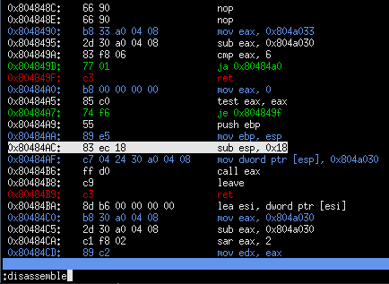

# sonare2
An interactive disassembler for reverse engineering

This is intended to be an alternative to radare2.
This also is an exercise in software architecture of interactive applications.

<p align="center"></p>

Build:
```
$ sudo apt install libcapstone-dev libsdl2-dev libncurses5-dev gdc
$ make
```

Run the unit tests:
```
$ ./check
```

Try it with an example binary:
```
$ ./bin/snr test/x86-bootsector.bin
Then, type "disassemble", then press enter (you can correct typos using '^H' (Ctrl + H))
Then, press escape to go to navigation mode.
You can scroll the view with 'j' and 'k' (as in vi).
```

Keys:
  * Command mode:
     * Go to navigation mode:   '^[' (escape key)
     * Command line completion: '\t' (tab key)
  * Navigation mode:
     * Switch to command mode:  ':' (colon key)
     * Scroll up:               'k'
     * Scroll down:             'j'

Commands:
  * help         - Get the list of supported commands
  * disassemble  - Disassemble the loaded binary
  * quit         - Quit the program

Directory structure:
```
  bin/         - Where the build output files go
  core/        - The core application. Here lives main, the presenter, interactive command line behaviour.
  plugins/     - Pluggable behaviors like: architectures, input binary formats, and views.
  test/        - Example binary files
```

